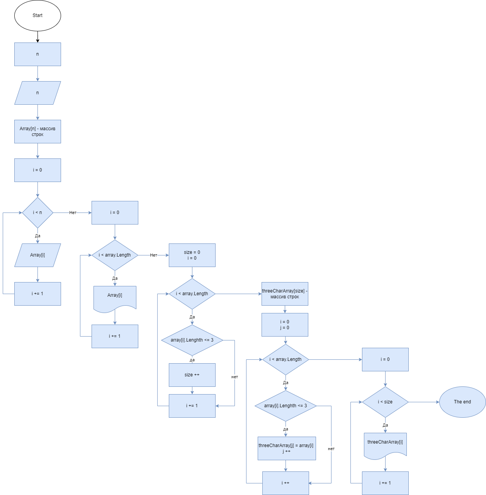

# Итоговая проверочная работа

**Задача:** Написать программу, которая из имеющегося массива строк формирует новый массив из строк, длина которых меньше, либо равна 3 символам. Первоначальный массив можно ввести с клавиатуры, либо задать на старте выполнения алгоритма. При решении не рекомендуется пользоваться коллекциями, лучше обойтись исключительно массивами.

**Примеры:**
* [“Hello”, “2”, “world”, “:-)”] → [“2”, “:-)”]
* [“1234”, “1567”, “-2”, “computer science”] → [“-2”]
* [“Russia”, “Denmark”, “Kazan”] → []

**Решение:**

1. Запрашиваем у пользователя длину массива.
2. С помощью метода выполняем заполнение массива строками, запрашивая у пользователя значения до тех пор, пока не достигнем ранее заданной длины массива.
3. Заданный массив выводится на экран с помощью метода, выводящим на экран значения элементов массива, пока индекс элемента массива не достигнет значения длины массива.
4. С помощью метода создаем новый массив из строк, длина которых меньше, либо равна 3 символам:
* С помощью цикла, проходящего по всем элементам массива, узнаем колличество элементов заданной длины, это значение будет длиной нового массива.
* С помощью цикла, в цикле проходим по всем элементам старого массива, сравнивая их по длине с заданным параметром, подходящие элементы записываем в новый массив.
5. Новый массив выводится на экран с помощью метода, выводящим на экран значения элементов массива, пока индекс элемента массива не достигнет значения длины массива.

[Ссылка на блок-схему решения](https://drive.google.com/file/d/1_wL4oohZS-NM8r_9xHc31EZvtle1QLDC/view?usp=share_link)

